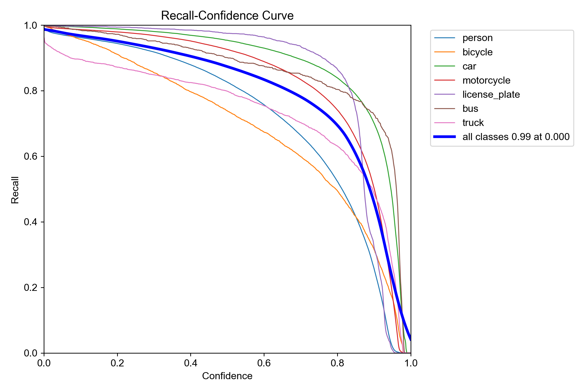
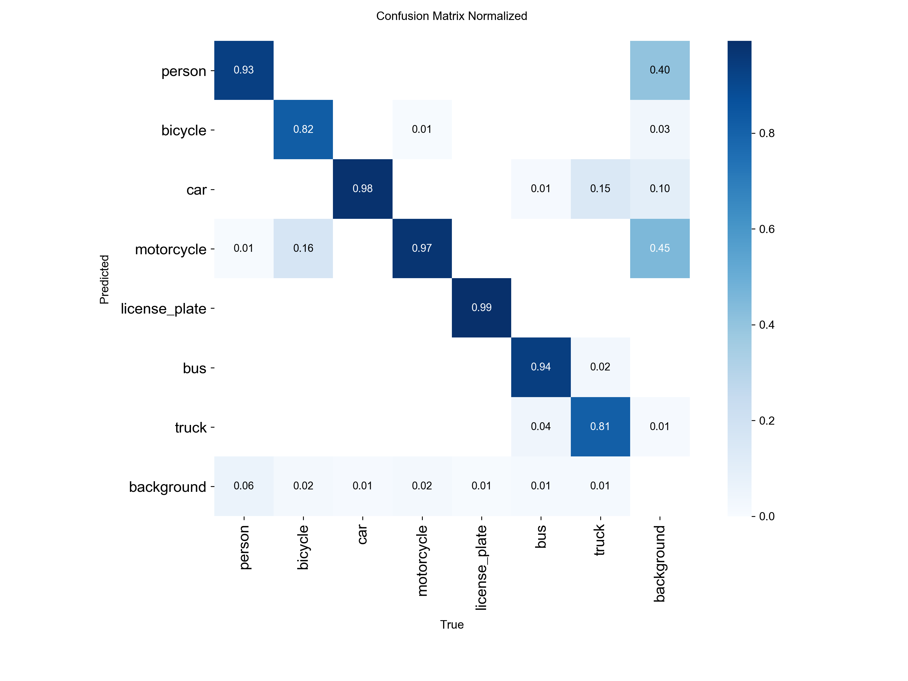
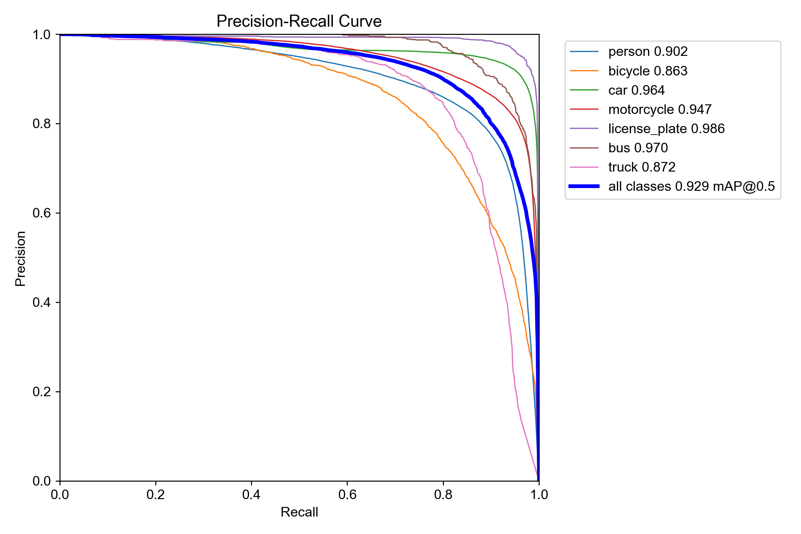
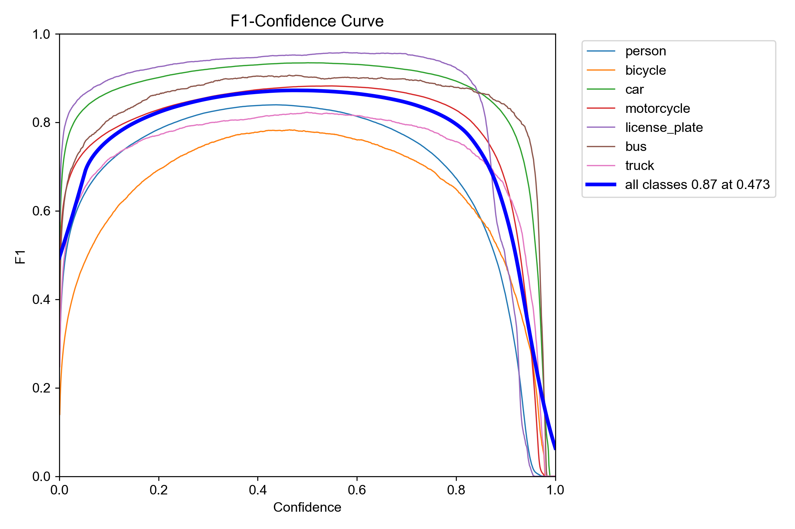

# CityVision AI Portal — Hệ Thống Giám Sát Giao Thông Thông Minh

Hệ thống giám sát giao thông tích hợp đầy đủ với phát hiện phương tiện, nhận diện biển số, đánh giá mức độ tắc nghẽn, và phát hiện vi phạm đỗ xe bằng **YOLO + PaddleOCR + ByteTrack**.

Hỗ trợ cả **Desktop GUI (Tkinter)** và **Web Portal (FastAPI)** với mô hình **Clean Architecture** được thiết kế hiện đại, tối ưu hiệu năng và khả năng mở rộng.

---

## 🎯 Tính Năng Chính

### 🚀 Phát Hiện & Tracking Real-time
- **Phát hiện 7 lớp đối tượng:** `person`, `bicycle`, `car`, `motorcycle`, `license_plate`, `bus`, `truck`.
- **Tracking hiệu năng cao:** Tích hợp bộ theo dõi đa đối tượng **ByteTrack** có độ ổn định cực cao.
- **Tối ưu hóa GPU/Cuda:** Hỗ trợ mô hình PyTorch (`.pt`) và tăng tốc phần cứng **NVIDIA TensorRT (`.engine`)** giúp tăng FPS lên gấp đôi.
- **Frame Skipping:** Cơ chế nhảy khung hình động linh hoạt tránh nghẽn luồng xử lý AI.

### 🔤 Nhận Diện Biển Số Đột Phá (ALPR)
- **PaddleOCR chuyên dụng:** Tự động cắt dòng biển số dài/ngắn, xử lý nhiễu nâng cao, tiền xử lý CLAHE và hiệu chỉnh góc nghiêng (Perspective Transformation).
- **Bộ lọc Regex & Voting:** Cơ chế bầu cử đa khung hình (Voting) giúp loại bỏ nhiễu chữ sai, đảm bảo độ chính xác lên tới >98%.
- **Lưu trữ bằng chứng:** Tự động lưu ảnh biển số thô, ảnh xử lý và xuất dữ liệu ra tệp CSV kèm cơ sở dữ liệu.
- **Grace Period (Bù khung hình biển số):** Áp dụng 5-frame grace period khi YOLO tạm thời mất dấu biển số, giúp hiển thị bounding box mượt mà không nhấp nháy, giữ thông tin biển số liên tục trên màn hình.

### 🚦 Giám Sát Tắc Nghẽn Đa Tầng
- **Đánh giá 4 mức độ:** Thông thoáng / Đông đúc / Rất đông / TẮC NGHẼN dựa trên mật độ xe (Occupancy) và vận tốc trung bình của dòng xe.
- **Cơ chế Debounce thông minh:** Tránh việc nhấp nháy cảnh báo liên tục khi số lượng xe dao động nhẹ ở ngưỡng.
- **Tính năng Snooze Alert:** Tự động tạm tắt cảnh báo trong một khoảng thời gian sau khi đã gửi thông báo đến quản trị viên qua Telegram.

### 🚨 Phát Hiện Vi Phạm Đỗ Xe Trái Phép (Illegal Parking)
- **Mô hình State Machine:** Quản lý vòng đời chặt chẽ qua các trạng thái: `MOVING` (Di chuyển) → `WAITING` (Dừng chờ) → `VIOLATION` (Vi phạm) → `RECORDED` (Đã lưu bằng chứng).
- **Thuật toán Spatial Re-ID độc quyền:** Khắc phục triệt để lỗi mất dấu xe tạm thời do góc khuất, cây cối hay chớp sáng. Sử dụng **Bản đồ ánh xạ ID (`track_id_map`)** giúp duy trì ID gốc ổn định trên màn hình, không bị nhảy số ID ngẫu nhiên.
- **Video bằng chứng tự động:** Trích xuất video vi phạm 15 giây (5s trước + 10s sau khi vi phạm) ở định dạng tương thích HTML5 (H.264) thông qua quá trình tự động re-encode phần cứng.
- **Cảnh báo đa kênh:** Gửi ảnh cảnh báo tức thời khi xe bắt đầu dừng và video bằng chứng qua Telegram Bot.

### 🌐 Web Portal Hiện Đại (Clean Architecture)
- **Kiến trúc Clean:** Phân lớp rõ ràng (Domain, Infrastructure, Application, Presentation) giúp bảo trì và mở rộng dễ dàng.
- **Hệ thống WebRTC Siêu Nhanh (<1s):** Tự động phát hiện bộ mã hóa phần cứng (`h264_nvenc` trên PC hoặc `h264_v4l2m2m` trên NVIDIA Jetson), ép khóa GOP I-frame 1 giây (`-forced-idr 1`) tạo ra luồng stream WebRTC mượt mà, tải tức thì dưới 1 giây.
- **Cơ chế Fast Fallback:** Tự động chuyển đổi sang MJPEG trong vòng **2 giây** nếu mạng nội bộ chặn giao thức UDP/mDNS.
- **Tối ưu hóa Tài nguyên IPC:** Tự động giảm tần suất cập nhật dữ liệu tiến trình xuống mức gần bằng 0 khi không có người dùng xem stream, giảm tải CPU/RAM tới 95%.
- **Bảng quản lý trực quan:** Login, Dashboard biểu đồ, Cameras, Users, Violations (Phạt nguội), Congestion, Vehicles, Test Video.

---

## 🖼️ Demo Hình Ảnh Hệ Thống


---

## 📈 Kết Quả Huấn Luyện (YOLO Training Metrics)
Mô hình YOLO được huấn luyện kỹ lưỡng qua nhiều epoch với các chỉ số chất lượng thực tế vô cùng ấn tượng:

### Biểu đồ Precision Confident và Recall Confident


### Đánh giá chất lượng nhận diện (Precision-Recall & Confusion Matrix)
- **Ma trận nhầm lẫn chuẩn hóa (Confusion Matrix Normalized):** Giúp kiểm soát độ chính xác phân loại giữa các lớp xe và biển số, tránh nhầm lẫn giữa nền (background) và vật thể.
- **Đường cong F1-Score / PR Curve:** Thể hiện độ tin cậy cân bằng tối ưu giữa Precision (độ chuẩn xác) và Recall (độ thu hồi) ở mọi ngưỡng tin cậy.





---

## 📋 Yêu Cầu Hệ Thống

| Thành phần | Yêu cầu |
|---|---|
| **Python** | 3.10+ |
| **GPU** | NVIDIA (Khuyên dùng từ 6GB VRAM trở lên) |
| **Nền tảng nhúng** | Hỗ trợ tối ưu cho NVIDIA Jetson (Jetpack 5.x/6.x) |
| **CUDA / TensorRT** | CUDA 12.x + TensorRT 10.x |
| **OS** | Windows 10/11 hoặc Linux (Ubuntu) |
| **Bộ nhớ** | Tối thiểu 8GB RAM |

---

## 📦 Cài Đặt & Khởi Tạo

### 1. Clone repo & Tạo môi trường ảo
```bash
cd e:\DATN_PROJECT
python -m venv venv
venv\Scripts\activate  # Windows
# source venv/bin/activate  # Linux
```

### 2. Cài đặt dependencies
```bash
pip install -r requirements.txt
```

**requirements.txt** bao gồm các thư viện cốt lõi:
```text
opencv-python
numpy
ultralytics
pyTelegramBotAPI
python-dotenv
requests
paddleocr
av
FastAPI
uvicorn
starlette
aiofiles
python-multipart
werkzeug
jinja2
```

---

## 📁 Cấu Trúc Thư Mục Dự Án

```text
e:\DATN_PROJECT\
├── app.py                          # FastAPI Entry Point (Web Portal) ⭐
├── main_api.py                     # FastAPI Entry Point (Legacy - routers/)
├── main.py                         # Desktop GUI Entry Point (Tkinter UI)
├── run_system.py                   # Bộ khởi chạy song song cả GUI & Web
├── requirements.txt
├── AI_CONTEXT.md                   # Ngữ cảnh chi tiết cho AI Pair-programming
│
├── core/                           # Cấu hình bảo mật hệ thống (dùng cho main_api.py)
│   ├── config.py
│   ├── security.py
│   ├── exceptions.py
│   └── utils.py
│
├── modules/                        # Logic nghiệp vụ AI dùng chung
│   ├── ocr/
│   │   ├── ocr_processor.py        # Pipeline xử lý PaddleOCR nâng cao
│   │   └── ocr_manager.py          # Hàng đợi OCR, bầu chọn & Grace Period
│   ├── parking/
│   │   ├── parking_logic.py        # Trạng thái đỗ xe (State Machine)
│   │   └── parking_manager.py      # Xử lý bằng chứng, ghép nối Spatial Re-ID ⭐
│   ├── traffic/
│   │   └── traffic_monitor.py      # Phân tích lưu lượng & mức độ tắc nghẽn
│   └── utils/
│       ├── alpr_logger.py          # Logging CSV & xuất báo cáo bằng chứng
│       ├── telegram_bot.py         # Module tương tác với Telegram
│       └── traffic_alert_manager.py
│
├── frontend/                       # Cấu trúc Clean Architecture của Web Portal
│   ├── app.py                      # Khởi động chính
│   ├── core/config.py              # Cấu hình cổng Web
│   ├── database/                   # Giao tiếp SQLite thông qua Repository Pattern
│   │   ├── sqlite_db.py
│   │   ├── sqlite_user_repo.py
│   │   └── sqlite_camera_repo.py
│   ├── domain/                     # Entities & Repository Interfaces
│   ├── application/                # Use Cases & DI
│   ├── infrastructure/             # Triển khai phần cứng (ML, Hardware JPEG, local file)
│   │   ├── file_system/
│   │   │   └── local_storage.py
│   │   └── ml/
│   │       ├── detection_bridge.py # Nhận diện đa luồng, đẩy RTSP, WebRTC ⭐
│   │       └── ocr_license_plate.py
│   ├── presentation/               # Giao diện Web (FastAPI Controllers/Views)
│   │   ├── container.py            # DI Container
│   │   └── web/
│   │       ├── auth_views.py
│   │       ├── camera_views.py
│   │       └── test_video_views.py
│   ├── templates/                  # Jinja2 Templates (HTML5)
│   ├── static/                     # CSS, Javascript (WebRTC player, Grid View)
│   └── portal.db                   # Cơ sở dữ liệu SQLite chính
│
├── models/                         # Nơi lưu trữ mô hình YOLO (.pt & .engine)
├── layouts/                        # Cấu hình vùng ROI dạng tệp JSON
└── logs/                           # Các thư mục lưu trữ phạt nguội và ảnh chụp
```

---

## 🚀 Hướng Dẫn Vận Hành

### Option A: Web Portal (Khuyên dùng) ⭐
```bash
python app.py
# Hoặc:
python -m uvicorn app:app --host 0.0.0.0 --port 5000
```
* Mở trình duyệt truy cập: `http://localhost:5000`
* **Tài khoản Administrator Mặc Định:** `admin` / `Admin@123`

**Các trang quản lý chính:**
- 📊 **Dashboard:** Tổng quan các thông số thống kê, biểu đồ lưu lượng xe.
- 📹 **Cameras:** Thêm, sửa, xóa, và kích hoạt giám sát WebRTC cho các luồng RTSP.
- 👤 **Users:** Phân quyền và quản lý tài khoản người dùng (`operator` và `admin`).
- 🚗 **Vehicles:** Xem lịch sử, tìm kiếm biển số xe đi qua vùng giám sát.
- ⚠️ **Violations:** Danh sách xe đỗ sai quy định kèm ảnh chụp vi phạm T0/T1 và video chứng cứ 15s.
- 🚦 **Congestion:** Nhật ký ùn tắc giao thông, mức độ và khoảng thời gian.
- 🎬 **Test Video:** Upload video cục bộ để kiểm tra hiệu năng hệ thống ngay trên giao diện web.

### Option B: Desktop GUI
```bash
python main.py
```
**Quy trình vận hành:**
1. Bấm **"Chọn Model YOLO"** → Chọn tệp `.pt` hoặc `.engine`.
2. Bấm **"Chọn Video"** → Chọn tệp video hoặc cấu hình RTSP.
3. Bấm **"Vẽ Vùng Quan Sát"** (nếu cần thiết lập ROI mới) → Bấm Enter để xác nhận.
4. Bấm **"Bắt đầu Detect"** để tiến hành phân tích luồng.
5. Nhấn **ESC** để tắt hoặc tạm dừng.

**Phím tắt khi vẽ ROI/Vùng Cấm Đỗ:**
- **Click chuột trái:** Thêm một điểm góc.
- **Click chuột phải:** Xóa toàn bộ các điểm đang vẽ.
- **Ctrl+Z / Z:** Undo điểm vừa vẽ.
- **Enter / Esc:** Hoàn thành vẽ và lưu lại tệp cấu hình JSON.

### Option C: Chạy Song Song Cả Hai Phiên Bản
```bash
python run_system.py
```
* Bản Web chạy ở cổng `5000`, bản Desktop Tkinter chạy song song cùng luồng xử lý chính.

---

## 📊 Cơ Sở Dữ Liệu (Database Schema)

Cơ sở dữ liệu SQLite được thiết kế thuần Việt để tối ưu việc lưu trữ thông tin giao thông. Tự động tạo tại `frontend/portal.db` gồm các bảng chính:

| Bảng | Mô tả chức năng |
|---|---|
| `nguoi_dung` | Tài khoản đăng nhập hệ thống (admin / operator) |
| `camera` | Danh sách luồng camera RTSP & cấu hình ROI |
| `bien_so_phat_hien` | Lịch sử nhận diện biển số xe bằng OCR |
| `lich_su_phuong_tien` | Toàn bộ phương tiện đi qua vùng giám sát |
| `vi_pham_do_xe` | Biên bản phạt nguội đỗ xe trái phép kèm hình ảnh |
| `nhat_ky_un_tac` | Nhật ký ghi nhận thời gian và mức độ tắc nghẽn |
| `thong_ke_giao_thong` | Lưu lượng phương tiện theo giờ/ngày |

---

## ⚙️ Xuất Mô Hình YOLO Sang TensorRT

TensorRT giúp tăng tốc độ nhận dạng phương tiện gấp ~2 lần trên GPU thông qua tối ưu hóa lượng tử hóa FP16.

```python
from ultralytics import YOLO

model = YOLO("models/best.pt")
model.export(
    format="engine",
    half=True,           # Lượng tử hóa FP16
    device=0,            # Chỉ định GPU số 0
    workspace=4,         # VRAM cấp phát tối đa (GB)
    imgsz=640,           # Kích thước ảnh đầu vào
    keras=False
)
# Kết quả xuất ra tệp: models/best.engine
```

**Lưu ý kỹ thuật:**
- Tệp `.engine` được tối ưu hóa đặc thù cho kiến trúc phần cứng của GPU lúc xuất. 
- Không thể di chuyển tệp `.engine` sang máy có GPU khác để chạy (cần xuất lại từ tệp `.pt` tương ứng).
- Cần cài đặt đúng thư viện CUDA Toolkit + TensorRT tương thích với PyTorch.

---

## 📈 Đánh Giá Hiệu Năng Xử Lý

| Cấu hình phần cứng | FPS Đạt Được | Độ trễ luồng stream |
|---|---|---|
| YOLO .engine (Lượng tử hóa TRT FP16) | 18 - 22 FPS | ~1.1 giây |

---

## 🎓 Huấn Luyện Mô Hình Tùy Chỉnh (Custom Training)

### 1. Chuẩn bị tập dữ liệu (Dataset)
Sắp xếp cấu trúc thư mục chuẩn định dạng YOLO:
```text
dataset/
├── images/
│   ├── train/  # Ảnh dùng để huấn luyện
│   └── val/    # Ảnh dùng để đánh giá
└── labels/
    ├── train/  # File nhãn .txt tương ứng (YOLO format)
    └── val/
```

### 2. Cấu hình tệp `dataset.yaml`
```yaml
path: /path/to/dataset
train: images/train
val: images/val

nc: 7
names: ['person', 'bicycle', 'car', 'motorcycle', 'license_plate', 'bus', 'truck']
```

### 3. Huấn luyện mô hình
```python
from ultralytics import YOLO

model = YOLO("yolov26m.pt")  # Tải mô hình pretrained mặc định

results = model.train(
    data="dataset.yaml",
    epochs=100,
    imgsz=640,
    batch=16,
    device=0,
    patience=20,
    project="TrafficAI",
    name="Run1",
    
    # Siêu tham số huấn luyện (Hyperparameters)
    lr0=0.001,
    lrf=0.01,
    warmup_epochs=3,
    
    # Kỹ thuật Tăng Cường dữ liệu (Data Augmentation)
    mosaic=1.0,
    mixup=0.1,
    degrees=10.0,
    hsv_s=0.5,
)

# Xuất mô hình sang tệp .pt và .engine
model.export(format="pt")
model.export(format="engine", half=True)
```

---

## 🔌 API Endpoints Hệ Thống Web

### Xác thực & Tài khoản
- `POST /login` — Tiến hành đăng nhập phiên làm việc.
- `GET /logout` — Hủy bỏ session, đăng xuất.

### Quản lý Camera
- `GET /cameras` — Trang giao diện quản lý camera.
- `POST /api/cameras` — Thêm cấu hình luồng camera RTSP mới.
- `PUT /api/cameras/{id}` — Cập nhật thông số camera.
- `DELETE /api/cameras/{id}` — Loại bỏ camera khỏi hệ thống.

### Lịch sử & Phạt nguội
- `GET /vehicles` — Trang tìm kiếm lịch sử các xe đi qua.
- `GET /api/license-plates` — API lấy danh sách biển số đã nhận diện.
- `GET /violations` — Trang chi tiết vi phạm đỗ xe trái phép.
- `GET /api/violations` — API lấy danh sách các lỗi phạt nguội đỗ xe.
- `GET /congestion` — Thống kê nhật ký và mức độ tắc nghẽn.

### Stream & Giám Sát
- `GET /test-video` — Trang kiểm thử video cục bộ.
- `POST /api/test-jobs` — Bắt đầu một tiến trình xử lý AI cho camera/video.
- `GET /api/test-jobs/{id}/stream` — Lấy luồng phát trực tiếp MJPEG.

---

## ⚙️ Các Ngưỡng Cấu Hình Hệ Thống

Các file mã nguồn chứa các ngưỡng cấu hình quan trọng có thể điều chỉnh tùy thuộc vào góc camera thực tế:

### 1. Phân Tích Tắc Nghẽn (`traffic_monitor.py`)
- `CONG_COUNT_THR = 10` — Đạt 10 phương tiện cùng lúc trong ROI để kích hoạt cảnh báo sơ bộ.
- `CONG_SPEED_THR = 10.0` — Vận tốc trung bình giảm xuống dưới 10px/s để phát hiện kẹt cứng.

### 2. Vi Phạm Đỗ Xe (`parking_logic.py`)
- `stop_seconds = 30` — Số giây tối đa xe được dừng trong vùng cấm trước khi tính vi phạm.
- `move_thr_px = 10.0` — Sai lệch khoảng cách tối đa (pixel) để coi một phương tiện là đứng yên.

### 3. Nhận Diện ALPR (`ocr_manager.py`)
- `OCR_INTERVAL = 4` — Tiến hành cắt ảnh chạy PaddleOCR mỗi 4 frame.
- `VOTE_THRESHOLD = 3` — Số lần nhận diện ra cùng một chuỗi chữ biển số để chốt kết quả.
- `MAX_LOST_FRAMES = 5` — Số khung hình giữ lại bounding box biển số khi YOLO bị mất dấu (Grace Period).

---

## 📝 Ghi Chú An Toàn & Hiệu Năng
- **Bảo mật tối đa:** Mật khẩu người dùng mã hóa an toàn qua hàm băm `werkzeug.security` và phiên làm việc lưu trong session tự động hết hạn sau 7 ngày.
- **Phát luồng realtime:** Luồng RTSP và WebRTC được xử lý hoàn toàn trên RAM (in-memory MJPEG) để tối ưu độ trễ, không ghi file thừa mứa làm hại ổ đĩa cứng.
- **Thông báo Telegram tiện lợi:** Phân cấp cảnh báo từ Cảnh báo vàng (Waiting - bắt đầu dừng) sang Cảnh báo đỏ (Violation - xác nhận vi phạm kèm video chứng cứ) trực quan.